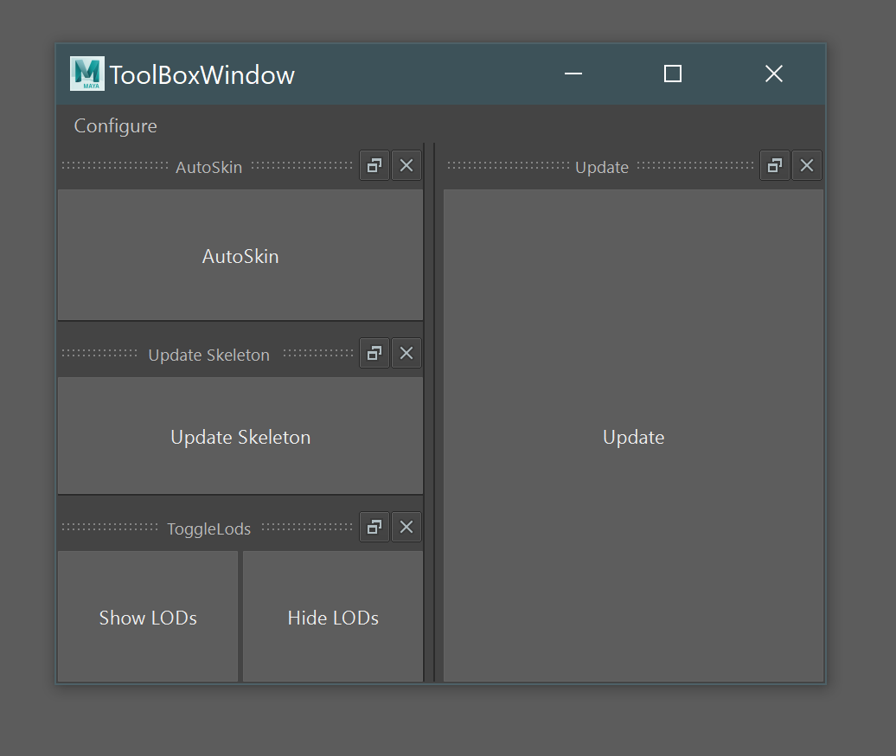

# dcc-toolbox
Customizable UI for quick DCC tool palettes

# How it works
Via the *Configure* button you can specify tools that should be visible in the UI.

Any subclass of ToolBoxItemBase can be added as QDockWidgets to the main UI.
In *dcc_toolbox_examples.py* you'll find some samples of how to define tool classes.

Classes with a *run* function defined will be executed on button press.

Classes with a *get_tool_actions* function defined will be added as individual buttons.

# Install

<pre>
1. Download this package and unzip it in a good location 
    1.B (or git clone it directly if you have git installed)
2. Run installer.bat (will walk you through some options for install)
3. Restart Maya
</pre>

# Start the tool
1. Run this script in a python tab in maya

<pre>

import dcc_toolbox
dcc_toolbox.main()

</pre>

